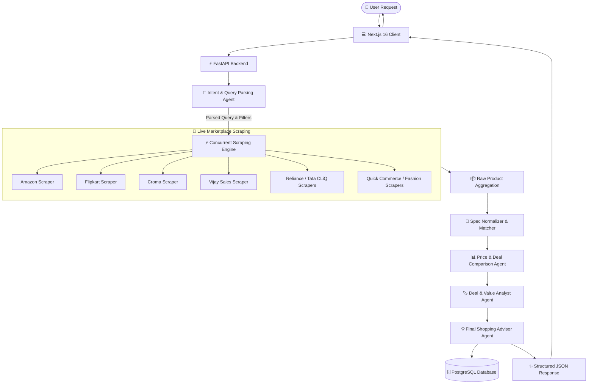

# 🛍️ ShoppingMindAI

<p align="center">
  
</p>

<p align="center">
  <strong>An Intelligent Multi-Agent Shopping Assistant & Real-Time Price Comparison Engine</strong>
</p>

## 🌟 Overview

**ShoppingMindAI** is a next-generation AI shopping concierge that simplifies online product research, spec evaluation, and deal finding across **15+ major e-commerce platforms in India**.

Powered by a collaborative **CrewAI multi-agent system** and multimodal LLMs (Google Gemini / DeepSeek / OpenAI), ShoppingMindAI transforms natural language queries (e.g., *"Find the best laptop under ₹50,000 for programming with 16GB RAM"*) into real-time scraped product options, normalized specifications, side-by-side price comparisons, and actionable deal negotiation advice.

---

## ✨ Key Features

- 🤖 **Autonomous Multi-Agent Workflow** — Coordinated AI agents handle intent classification, live scraping, price normalization, deal negotiation, and final product advice.
- ⚡ **Real-Time Concurrent Scraping** — High-speed parallel scraping across 15+ marketplaces with proxy rotation and anti-bot resilience via Playwright and ZenRows.
- 🏷️ **Multi-Store Price Comparison** — Automatic canonical spec matching to find the true lowest price across competing stores.
- 🎯 **Interactive Filter Cards & Spec Pills** — Dynamic UI filter cards that let users refine specifications (RAM, SSD, processor, brand, budget) seamlessly.
- 💬 **Conversational Shopping Memory** — Session-aware PostgreSQL storage that retains context across multi-turn shopping chats.
- 📊 **Deal Evaluation & Value Scoring** — Intelligent discount calculation, rating normalization, and bank offer breakdowns.
- 🎨 **Modern Next.js 16 Interface** — Fast, accessible, and responsive UI built with Tailwind CSS v4, Framer Motion animations, and Lucide icons.
- 🔌 **Pluggable AI Providers** — Seamless switching between Google Gemini, DeepSeek, and OpenAI models.

---

## 🛒 Supported Marketplaces

ShoppingMindAI aggregates and compares live prices across multiple shopping verticals:

| Vertical | Supported Stores |
| :--- | :--- |
| **Electronics & Gadgets** | **Amazon India**, **Flipkart**, **Croma**, **Reliance Digital**, **Vijay Sales**, **Tata CLiQ** |
| **Fashion & Lifestyle** | **Myntra**, **Ajio**, **Snapdeal**, **Meesho** |
| **Quick Commerce & Grocery** | **Blinkit**, **Zepto**, **BigBasket** |
| **Beauty & Kids** | **Purplle**, **FirstCry** |

---

## 🧠 Multi-Agent Architecture

The intelligence layer uses **CrewAI** to orchestrate specialized agents working together:



### Agent Roles:
1. **Intent & Spec Parser**: Deconstructs user queries into canonical attributes (brand, RAM, storage, budget, color).
2. **Scraper Orchestrator**: Triggers concurrent Playwright & API scrapers with timeout bounds and fallback strategies.
3. **Spec Normalizer**: Cleans noisy titles, resolves duplicate variations, and standardizes currency and specs.
4. **Comparison Analyst**: Detects lowest prices, computes savings, and verifies merchant reliability.
5. **Shopping Advisor**: Crafts natural-language summaries, pros/cons, and interactive filter recommendations.

---

## 📂 Project Structure

```
ShoppingMindAI/
├── backend/
│   ├── app/
│   │   ├── agent/                 # CrewAI agent definitions, tasks, and tool bindings
│   │   │   ├── crew.py            # Agent crew configuration and execution pipelines
│   │   │   └── tools.py           # Custom CrewAI search & comparison tools
│   │   ├── api/                   # FastAPI route controllers
│   │   │   ├── search.py          # Chat, search, and product retrieval endpoints
│   │   │   ├── session.py         # Conversation session management
│   │   │   └── dashboard.py       # Analytics and monitoring stats
│   │   ├── core/                  # Global application configuration and settings
│   │   ├── database/              # SQLAlchemy models, CRUD operations, and DB engine
│   │   ├── schemas/               # Pydantic request and response models
│   │   ├── services/              # Core business logic & scrapers
│   │   │   ├── scraper.py         # Multi-store Playwright & BeautifulSoup scrapers
│   │   │   ├── normalizer.py      # Product specification normalization
│   │   │   ├── parser.py          # AI query & filter extraction
│   │   │   └── zenrows.py         # Anti-bot proxy & web scraping integration
│   │   └── utils/                 # Data helpers and logging utilities
│   ├── scripts/                   # Migration and diagnostic scripts
│   ├── tests/                     # Unit and integration test suites
│   ├── requirements.txt           # Python dependencies
│   └── .env.example               # Backend environment template
│
├── frontend/
│   └── ai-shopping-ui/            # Next.js 16 Frontend Web Application
│       ├── app/                   # App Router pages and layout
│       ├── components/            # React UI components
│       │   ├── chat/              # Chat message stream and input box
│       │   ├── product/           # Product cards, badges, and comparison tables
│       │   ├── sidebar/           # Conversation history sidebar
│       │   └── common/            # Buttons, modals, and loader components
│       ├── hooks/                 # Custom React hooks
│       ├── services/              # API communication clients
│       └── package.json           # Node.js dependencies
└── README.md
```

---

## 🚀 Getting Started

### Prerequisites

Ensure you have the following installed on your system:
- **Python 3.11+**
- **Node.js 18+** or **Bun**
- **PostgreSQL** (Optional; falls back gracefully for quick testing)
- **Google Gemini API Key** or **DeepSeek / OpenAI API Key**

---

### 1. Backend Setup

1. **Navigate to the backend directory:**
   ```bash
   cd backend
   ```

2. **Create and activate a virtual environment:**
   ```bash
   # Windows (PowerShell)
   python -m venv venv
   .\venv\Scripts\activate

   # macOS / Linux
   python3 -m venv venv
   source venv/bin/activate
   ```

3. **Install Python dependencies:**
   ```bash
   pip install -r requirements.txt
   ```

4. **Install Playwright browser binaries:**
   ```bash
   playwright install chromium
   ```

5. **Configure Environment Variables:**
   Create a `.env` file inside `backend/` (or copy `.env.example`):
   ```env
   ENVIRONMENT=development
   LOG_LEVEL=INFO
   AGENT_MODE=true

   # AI Provider Configuration (gemini, deepseek, or openai)
   AI_PROVIDER=gemini
   GEMINI_API_KEY=your_google_gemini_api_key_here
   DEEPSEEK_API_KEY=your_deepseek_api_key_here
   OPENAI_API_KEY=your_openai_api_key_here

   # PostgreSQL Database (Optional for testing)
   DB_HOST=localhost
   DB_PORT=5432
   DB_NAME=shoppingmindai
   DB_USER=postgres
   DB_PASSWORD=your_password
   AUTO_CREATE_TABLES=true

   # CORS & Security
   CORS_ORIGINS=http://localhost:3000,http://127.0.0.1:3000
   ALLOWED_HOSTS=localhost,127.0.0.1

   # Web Scraping Resilience (Optional: ZenRows proxy)
   ZENROWS_API_KEY=your_zenrows_api_key
   ZENROWS_ENABLED=false
   ```

6. **Start the FastAPI server:**
   ```bash
   python -m uvicorn app.main:app --reload --host 0.0.0.0 --port 8000
   ```

   - **API Server:** `http://localhost:8000`
   - **Interactive Swagger Docs:** `http://localhost:8000/docs`
   - **Health Check:** `http://localhost:8000/health/ready`

---

### 2. Frontend Setup

1. **Navigate to the frontend application:**
   ```bash
   cd frontend/ai-shopping-ui
   ```

2. **Install Node.js dependencies:**
   ```bash
   npm install
   # or
   bun install
   ```

3. **Configure Environment Variables:**
   Create `.env.local` inside `frontend/ai-shopping-ui/`:
   ```env
   NEXT_PUBLIC_API_URL=http://127.0.0.1:8000
   ```

4. **Start the development server:**
   ```bash
   npm run dev
   # or
   bun dev
   ```

5. **Open your browser:**
   Visit [http://localhost:3000](http://localhost:3000) to start shopping with AI!

---

## 📡 API Reference

### Health & Diagnostics
- `GET /health/live` — Returns service liveness status (`{"status": "ok"}`).
- `GET /health/ready` — Checks database connectivity and agent engine readiness.
- `GET /agent/status` — Reports current active pipeline mode (`crewai_agent` or `original_parser`).

### Search & Chat
- `POST /api/search` — Sends user query or follow-up prompt to the AI agent crew.
  ```json
  {
    "query": "Best gaming laptop under 75000 with RTX 3050",
    "session_id": "optional-uuid",
    "filters": {
      "ram": "16GB",
      "budget": 75000
    }
  }
  ```

### Session Management
- `GET /api/session/{session_id}` — Retrieves conversation history and past product comparisons.
- `DELETE /api/session/{session_id}` — Clears a specific session.

### Analytics Dashboard
- `GET /api/dashboard/stats` — Provides usage metrics, queries searched, and system status.

---

## 🛡️ Scraping Resilience & Anti-Bot Strategy

ShoppingMindAI employs a robust multi-layered data extraction architecture:
- **Headless Chromium Automation** with realistic user-agent spoofing, viewport randomization, and human-like cursor movements.
- **Direct API & JSON-LD Extraction** where available for sub-second retrieval.
- **ZenRows / ScrapeOps Integration** for bypass of Cloudflare, Akamai, and perimeter challenge pages.
- **Graceful Timeouts & Per-Store Fallbacks** ensuring a single slow marketplace never blocks the user experience.

---

## 🗺️ Roadmap

- [x] CrewAI Multi-Agent Architecture
- [x] Real-time scraping across 15+ Indian stores
- [x] Next.js 16 UI with dynamic filter cards
- [x] Session persistence with PostgreSQL
- [ ] 📈 Historic Price Trend & Drop Alerts
- [ ] 🔔 Stock Availability Webhooks
- [ ] 👤 User Accounts & Custom Wishlists
- [ ] 📱 Mobile App (React Native / Flutter)
- [ ] 🌐 International Marketplace Expansion (Amazon US, BestBuy, Walmart)

---

## 🤝 Contributing

Contributions make the open-source community thrive! Any contributions you make are **greatly appreciated**.

1. Fork the Project
2. Create your Feature Branch (`git checkout -b feature/AmazingFeature`)
3. Commit your Changes (`git commit -m 'Add some AmazingFeature'`)
4. Push to the Branch (`git push origin feature/AmazingFeature`)
5. Open a Pull Request

---

## 📄 License

Distributed under the MIT License. See `LICENSE` for more information.

---

<p align="center">
  Built by <a href="https://github.com/AshithaSujith">Ashitha Sujith</a>
</p>
